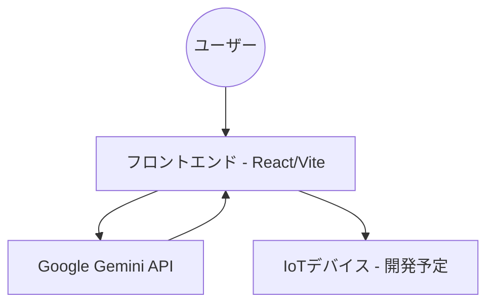

# SmartStudy Gate 現状プログラム構成・引継ぎ資料

## 1. プロジェクト概要
**SmartStudy Gate** は、AIを活用して子供の宿題の「質」を評価し、物理的な制限（IoTデバイス）やデジタル的な制限（スクリーンタイム）と連動させることで、親子間の対立を解消し自律的な学習習慣を支援するシステムです。

### 主要コンセプト
- **Smart Analysis**: Gemini APIを用いた宿題のBefore/After画像差分解析。
- **Smart Reward**: 学習の頑張りに応じた報酬（ゲーム時間の解錠）。
- **Smart Guard**: 物理デバイスやアプリ制限による学習時間の確保。

---

## 2. システムアーキテクチャ

### 全体構成
現在は **Phase 1 (AI評価エンジンの確立)** のプロトタイプ段階にあり、フロントエンド（React/Vite）を中心としたSPA（Single Page Application）として構成されています。



### 技術スタック
- **Frontend**: React, TypeScript, Vite
- **Styling**: Vanilla CSS, Lucide React (Icons), Framer Motion (Animations)
- **AI Engine**: Google Generative AI (Gemini 1.5 Flash)
- **State Management**: React Hooks (useState, useEffect)

---

## 3. ディレクトリ構造

```text
SmartStudy-Gate/
├── frontend/               # フロントエンド・ソースコード
│   ├── src/
│   │   ├── components/    # 共通UIコンポーネント
│   │   ├── views/         # 主要画面
│   │   │   ├── MissionCamera.tsx  # 写真撮影・AI解析実行画面
│   │   │   └── ResultView.tsx     # 解析結果表示画面
│   │   ├── lib/           # 外部API連携ロジック (Gemini API等)
│   │   ├── styles/        # CSSスタイル定義
│   │   ├── App.tsx        # エントリーポイント・ルーティング管理
│   │   └── main.tsx       # レンダリング設定
│   ├── package.json
│   └── vite.config.ts
├── backend/                # バックエンド・ソースコード (現在は空)
├── images/                 # ドキュメント・サンプル用画像
├── results/                # AI解析のテスト結果ログ
├── scripts/                # 補助スクリプト
├── 仕様書.md               # 製品全体の基本仕様
├── Phase1_詳細設計書.md    # フェーズ1の技術詳細
└── AIモデル評価レポート.md # Geminiの認識精度検証レポート
```

---

## 4. 実装済み機能の解説

### 4.1 ロール選択 (App.tsx)
- アプリ起動時に「管理者（親）」または「挑戦者（子供）」を選択。
- 現在は子供用モードのフローを中心に実装。

### 4.2 ミッションカメラ (MissionCamera.tsx)
- 子供が宿題の着手前（Before）と完了後（After）の2枚の写真を撮影またはアップロードするフロー。
- 解析中のアニメーション演出により、子供のワクワク感を創出。

### 4.3 AI学習評価 (lib/gemini.ts)
- Gemini 3.0 Flash (Preview) を使用。
- Before/Afterの差分から「作業量」「試行錯誤」「丁寧さ」「振り返り」の4項目を10点満点でスコアリング。
- 子供向けのポジティブなフィードバックと、親向けの客観的なレポートを生成。

### 4.4 解析結果表示 (ResultView.tsx)
- 獲得スコアとAIからのフィードバックを視覚的に表示。
- スコアに応じた演出を実装。

---

## 5. 今後の開発課題 (Todo)
1. **管理者ダッシュボードの実装**: 親が学習履歴を確認し、評価基準をチューニングする機能。
2. **バックエンド連携**: Firebase等のDBを導入し、ユーザーデータや学習履歴を永続化。
3. **物理デバイス(IoT)連携**: NFCリーダーと連動し、解錠信号を送る仕組みの実装。
4. **スクリーンタイム制限**: iOS/AndroidのネイティブAPIとの連携（将来的なスマホアプリ化）。

---

## 6. セットアップ・実行方法

### フロントエンドの起動
```bash
cd frontend
npm install
npm run dev
```
※ `.env` ファイルに `VITE_GEMINI_API_KEY` を設定する必要があります。

---
**作成日**: 2026年2月1日
**作成者**: Antigravity (Advanced Agentic Coding AI)
